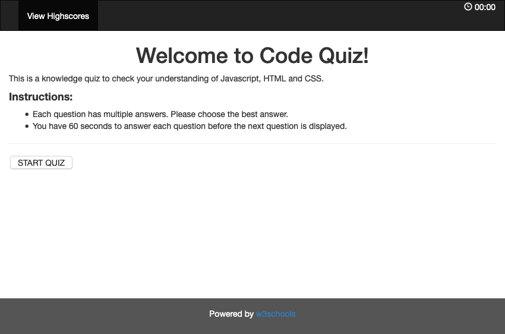
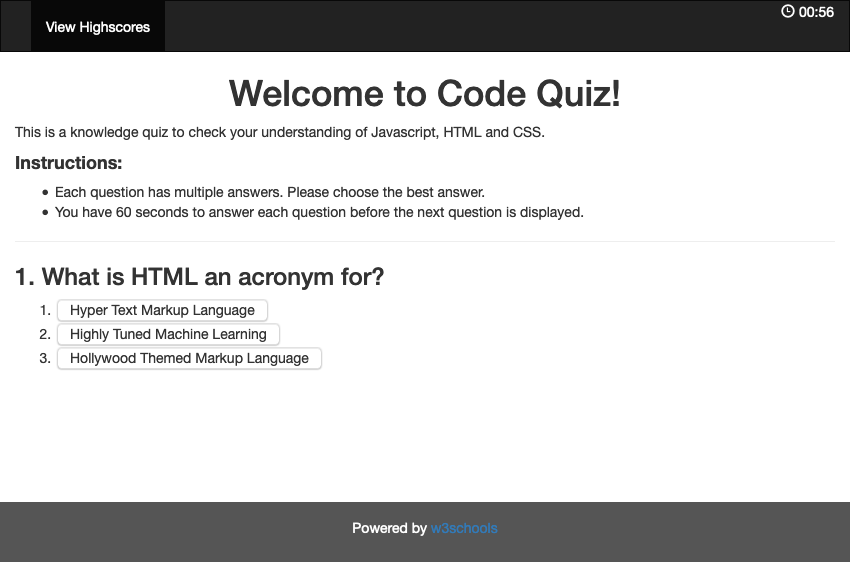
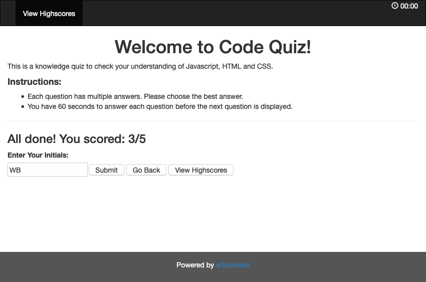

# Code Quiz

## Description 
A web-application that allows the user take a timed code-quiz consisting of mutlitple-choice questions. The application has a responsive and polished user interface and has scoring capabilities.

## Table of Contents (Optional)

* [Usage](#usage)
* [Credits](#credits)
* [License](#license)
* [Tests](#tests)

## Usage 

Access web-page here: (https://omair-muhi.github.io/code-quiz/)

## Credits
* UoT FSF Bcamp - this template
* W3 Schools Bootstrap templates: (https://www.w3schools.com/bootstrap/bootstrap_templates.asp)
* W3 Schools - How To Modal: (https://www.w3schools.com/howto/howto_css_modals.asp)

## License

MIT License

## Test Cases
#### Main
1. Test to ensure quiz starts when 'Start Quiz' is clicked - OK
2. Test to ensure highscores can be viewed from nav-bar before quiz - OK
3. Test to ensure highscores can be viewed from nav-bar during quiz - OK
4. Test to ensure highscores can be viewed from nav-bar after quiz - OK
5. Test to ensure answering a question advances to next question - OK
6. Test to ensure answering the last question displays all-done screen  - OK
7. Test to ensure 'View Highscores' on final screen displays HS modal. - OK
8. Test to ensure quiz resets when 'Go Back' is clicked. - OK
9. Test to ensure no score is recorded after first attempt before 'Submit' is clicked - OK
10. Test to ensure score is reported in modal after submitting initials. - OK
11. Test to ensure mutiple scores from same user can be reported. - OK
12. Test to ensure HS report from nav-bar and 'View Highscores' is identical - OK
### Responsiveness
1. Test to ensure page elements are responsive when resized - OK
2. Test to ensure nav-bar functions when collapsed. - OK
#### Timer
1. Test to ensure timer runs starts when quiz starts and stops after last question - OK
2. Test to ensure time is subtracted if an answer is wrong - OK
3. Test to ensure timer reports '00:00' outside of quiz - OK
4. Test to ensure timer reports correct time during quiz - OK
### Scoring logic
1. Test to ensure final score displayed matches with number of correct/incorrect answers during quiz - OK
#### High Scores (HS)
1. Test to ensure HS modal displays no scores when quiz never attempted - OK
2. Test to ensure HS modal displays one score when quiz attempted once - OK
3. Test to ensure HS modal displays sorted two scores when quiz attempted twice - OK
4. Test to ensure HS modal displays sorted three scores when quiz attempted thrice - OK
5. Test to ensure HS modal displays sorted top three scores when quiz attempted > 3x - OK
6. Test to ensure HS modal can be closed by clicking 'x'. - OK

---
© 2019 Trilogy Education Services, a 2U, Inc. brand. All Rights Reserved.
